<div align="center">

  <!-- Animated Premium SVG Banner -->
  

[](https://nextjs.org/)
[](https://flask.palletsprojects.com/)
[](https://www.mongodb.com/)
[](LICENSE)

A modern, full-stack task management application featuring **AI-powered task classification**, **priority-based insights**, and a **polished dashboard interface** that adapts dynamically to your lifestyle.

[Explore Demo](#-features-walkthrough) • [Quick Start](#-quick-start) • [API Docs](#-api-reference) • [UX Philosophy](#-ux-principles-applied)

</div>

---

## 🎯 Project Highlights

### ✅ Production-Ready Features
*   🤖 **AI Task Classification** - Auto-categorize tasks with confidence scoring & reasoning.
*   📊 **Smart Dashboard** - Priority-based AI insights that adapt dynamically to task state.
*   🔐 **User Authentication** - Secure sign-up, login, profile updates, and password resets using robust **bcryptjs** hashing.
*   🎨 **Four-Column Layout** - Streamlined categorization: `Today` ➔ `Tomorrow` ➔ `Overdue` ➔ `Upcoming`.
*   ⚡ **Intelligent Navigation** - Context-aware scrolling, section highlighting, and smart collapses.
*   📱 **Responsive Design** - Mobile-optimized layouts with butter-smooth micro-animations.
*   👤 **User Isolation** - Multi-tenant isolation ensuring users only access their personal tasks.
*   🔄 **Instant UI Sync** - State-driven updates reflected immediately without annoying page reloads.

### 🧠 UX Principles Applied
*   **Priority-based AI insights** (Overdue > Active > Completed > Empty)
*   **State-aware navigation** (no surprise scrolling, predictable toggle animations)
*   **Zero-blink transitions** (pure CSS transitions + `requestAnimationFrame`)
*   **Pristine Modal state management** (full resets on opening to prevent stale data)
*   **High-fidelity visual feedback** (green pulse highlights, chevron rotations, interactive hover states)

---

## 🔎 Quick Navigation
*   [🏗️ Architecture](#️-architecture)
*   [📂 Project Structure](#-project-structure)
*   [🚀 Quick Start](#-quick-start)
*   [🎨 Features Walkthrough](#-features-walkthrough)
*   [🤖 AI Task Categorization](#-ai-task-categorization)
*   [📡 API Reference](#-api-reference)
*   [🧪 Testing](#-testing)
*   [🛡️ Security Analysis](#️-security-analysis)

---

## 🏗️ Architecture

```
┌─────────────────┐      HTTP      ┌──────────────────┐      HTTP      ┌──────────────────┐
│   Frontend      │────────────────>│   Backend        │────────────────>│   AI Service     │
│   (Next.js)     │<────────────────│   (Plain Node)   │<────────────────│   (Flask)        │
│   Port 3000     │   REST API      │   Port 5000      │   Classify API  │   Port 8000      │
│                 │                 │                  │                 │                  │
│ • Dashboard     │                 │ • Task CRUD      │                 │ • NLP Classifier │
│ • Auth Interface│                 │ • User Profile   │                 │ • Confidence     │
│                 │                 │                  │                 │ • Explainability │
└─────────────────┘                 └────────┬─────────┘                 └──────────────────┘
                                             │
                                             │ MongoDB Driver
                                             ▼
                                    ┌──────────────────┐
                                    │   MongoDB Atlas  │
                                    │   (Cloud DB)     │
                                    └──────────────────┘
```

---

## 📂 Project Structure

```
TaskPilot/
├── backend/                    # Node.js REST API (Plain HTTP Server, No Express)
│   ├── src/
│   │   ├── models/            # MongoDB Schemas (Task, User)
│   │   ├── controllers/       # Business Controllers (task, user)
│   │   ├── utils/             # Helper utilities (HTTP parsers, CORS headers)
│   │   └── router.js          # Custom lightweight HTTP router
│   ├── .env.example           # Environment template
│   └── package.json
│
├── frontend/                   # Next.js 16.1.6 (Turbopack layout directly at root)
│   ├── app/                   # Dashboard, login, register, and page layouts
│   ├── components/            # Task card components, task modals, register helpers
│   ├── contexts/              # Authentication & global application state
│   ├── utils/                 # Frontend helpers (API handlers, browser storage)
│   └── package.json
│
├── ai-service/                 # Python Flask AI Service
│   ├── app.py                 # Flask server
│   ├── classifier.py          # NLP task classifier
│   └── requirements.txt
│
├── start-services.bat          # Windows helper to start all services
├── test_services.py            # Service connectivity tester
└── README.md                   # You are here
```

### 📄 Utility Scripts
*   [`start-services.bat`](file:///d:/TaskPilot/start-services.bat) - Windows batch script to launch all three services simultaneously *(Windows only)*
*   [`test_services.py`](file:///d:/TaskPilot/test_services.py) - Python script to verify backend, frontend, and AI service connectivity

---

## 🚀 Quick Start

### Prerequisites
*   **Node.js** v18+ ([Download](https://nodejs.org/))
*   **Python** 3.12+ ([Download](https://www.python.org/))
*   **MongoDB Atlas** account ([Sign up free](https://www.mongodb.com/cloud/atlas))
*   **Git** ([Download](https://git-scm.com/))

### 1️⃣ Clone Repository
```bash
git clone https://github.com/abhijithk-ak/TaskPilot.git
cd TaskPilot
```

### 2️⃣ Backend Setup
```bash
cd backend
npm install

# Create .env file from template
cp .env.example .env

# Edit .env and add your MongoDB credentials:
# MONGODB_URI=mongodb+srv://<username>:<password>@<cluster-url>/taskpilot?retryWrites=true&w=majority

# Start backend server
npm run dev
```
👉 Backend running on **http://localhost:5000**

### 3️⃣ AI Service Setup
```bash
cd ../ai-service

# Create virtual environment
python -m venv venv

# Activate (Windows)
.\venv\Scripts\Activate.ps1

# Activate (Mac/Linux)
source venv/bin/activate

# Install dependencies
pip install -r requirements.txt

# Start AI service
python app.py
```
👉 AI Service running on **http://localhost:8000**

### 4️⃣ Frontend Setup
```bash
cd ../frontend
npm install

# Start development server
npm run dev
```
👉 Frontend running on **http://localhost:3000**

### 🎉 Access Application
Open your browser and navigate to:
```
http://localhost:3000
```

---

## 🎨 Features Walkthrough

### 📊 Dashboard Layout

**Four Dynamic Columns:**
*   🔵 **Today** - Active + completed tasks due today (blue gradient highlight)
*   🟡 **Tomorrow** - Tasks due tomorrow (yellow gradient highlight)
*   🔴 **Overdue** - Past due tasks requiring attention (red gradient highlight)
*   🟣 **Upcoming** - Future tasks (purple gradient highlight)

**Adaptive Layout:**
*   Columns automatically appear/disappear based on task availability.
*   Grid auto-adjusts layout dynamically (2-4 columns based on current content).
*   Fully mobile-responsive with single-column layout transitions.

### 🤖 AI Productivity Insights

**Priority-Based Intelligence Engine:**

```
1️⃣ Overdue tasks exist     ➔ ⚠️ Warning tone (Red alert styling)
                               "You have 3 overdue tasks..."

2️⃣ Active tasks today      ➔ 🎯 Focus tone (Blue accent styling)
                               "Peak hours: 10-12 PM. Focus on..."

3️⃣ Today complete          ➔ 🎉 Success tone (Green accent styling)
                               "Great work! All tasks completed..."

4️⃣ No tasks                ➔ 💡 Neutral tone (Slate/gray styling)
                               "Clean slate! Add tasks..."
```

---

## 📡 API Reference

### Backend Endpoints (Port 5000)

#### User Authentication API
```http
POST   /auth/register               # Sign up a new user (with password hashing)
POST   /auth/login                  # Log in and check credentials
POST   /auth/reset-password         # Reset account password
GET    /auth/profile?email={email}  # Retrieve user profile & settings
PUT    /auth/profile                # Update name & custom preferences
```

#### Tasks API
```http
GET    /tasks?userEmail={email}     # Fetch all tasks scoped to email
POST   /tasks                       # Create a new task
PUT    /tasks/:id                   # Update an existing task
DELETE /tasks/:id                   # Delete a task
POST   /tasks/classify              # AI Task classification
```

---

## 🛡️ Security Analysis

Before committing and pushing this codebase to public Git repositories, please review the security audit checklist below:

### 🚨 Vulnerability Highlights

1.  **Missing Authentication/Authorization Middleware**:
    *   *Observation*: The custom backend routing structure processes data operations (e.g., retrieving tasks) by matching parameters such as `?userEmail={email}` directly from query inputs. There is no active validation check like a JWT authorization header or session validation.
    *   *Mitigation*: Implement standard token-based validation (JWT signature checks) on routes mapping parameters other than `/auth/login` and `/auth/register`.
2.  **No Payload Size Limit (Potential Denial of Service)**:
    *   *Observation*: The manual `parseBody(req)` function inside `backend/src/utils/http.js` processes requests by continuously appending incoming chunks without restriction:
        ```javascript
        req.on('data', chunk => { data += chunk; });
        ```
    *   *Mitigation*: Implement a boundary check (e.g., limit incoming strings to `1MB` maximum size limit) to prevent memory exhaustion crashes.
3.  **Global CORS Policy**:
    *   *Observation*: The headers inside [`http.js`](file:///d:/TaskPilot/backend/src/utils/http.js) export `Access-Control-Allow-Origin: '*'` to all origins.
    *   *Mitigation*: Restrict cross-origin rules to production domains instead of using the wildcard parameter.

### 🔐 Git Push Safety
*   **Database Credentials**: Actual Database connections are pulled from `process.env.MONGODB_URI`. Make sure your active `backend/.env` file containing secrets is **never** committed to version control.
*   **Ignore Patterns**: The global [`.gitignore`](file:///d:/TaskPilot/.gitignore) contains rule blocks for `.env`, `node_modules/`, and `venv/`, ensuring standard build configs and secrets are safely ignored during `git add .` staging routines.

---


## 🤝 Contributing

We welcome contributions! Here's how:

1.  **Fork** the repository
2.  **Create** your feature branch
    ```bash
    git checkout -b feature/AmazingFeature
    ```
3.  **Commit** your changes
    ```bash
    git commit -m 'feat: add AmazingFeature'
    ```
4.  **Push** to the branch
    ```bash
    git push origin feature/AmazingFeature
    ```
5.  **Open** a Pull Request

---

## 📄 License

This project is open source and available under the **MIT License**.
